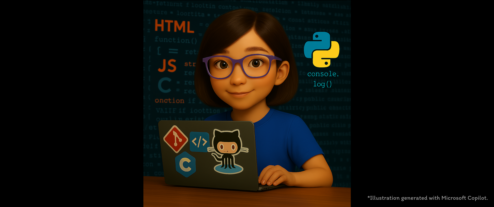

# Kia ora, I'm Ako 👋
Recent Bachelor of Computing Systems graduate passionate about building efficient, user-friendly software that genuinely improves people’s lives in ethical and trustworthy ways.  
  
## 👩‍💻 Recent Projects  
### 💻 Chingu Solo Project - Job Search Helper  
Built a full-stack MVP web application to join Chingu Voyage! The app helps users keep track of their job or company research, which aligns with my current needs.    
- **Frontend:** React · Tailwind CSS · TypeScript · React Hook Form · Zod · Vercel [[Job Search Helper - Frontend](https://github.com/AkoKBIkeda/job-search-helper-frontend)]  
- **Backend:** Django REST framework · Postman · Render [[Job Search Helper - Backend](https://github.com/AkoKBIkeda/job-search-helper-backend)]  

### 💻 Capstone Project  
Developed a full-stack web application in collaboration with an international company, focusing on responsive UI, seamless user experience, and AI-powered features.   
- **Frontend:** React · Tailwind CSS · JavaScript · Recharts · Jest  
- **Backend:** Django REST framework · OpenAI · Postman  

### 💻 AI Hackathon 2025 by AI Forum NZ  
Developed an MVP suggesting balanced school lunch menus, improving variety and appeal within existing nutrition, portion, and budget constraints for centralised meal providers.    
- **Frontend:** React · Tailwind CSS · JavaScript · Vercel [[kAI - Frontend](https://github.com/AkoKBIkeda/happytummy-frontend)]    
  
## 🛠️ Current Projects
Building a portfolio and joining the Chingu Voyage 57 as a developer!  
  
## 🧰 Tech Stack
- **Frontend Development:** React · Tailwind CSS · HTML · CSS · JavaScript  
- **Backend Development & APIs:** Django · Django REST framework · Python · OpenAI API  
- **Mobile & Desktop Development:** Android Studio (Java) · C# Windows Forms App (.NET) · Java   
- **Tools & Platforms:** Git · GitHub · Figma · Jira (AgileBox) · Confluence  
  
## 🌱 Current Learning
TypeScript, Vite, clean architecture in full-stack projects, mobile development frameworks, and cloud computing.  
  
## 🤝 Core Values
- Collaboration and clear communication
- Continuous learning and improvement
- Building software that positively impacts users and the community  
