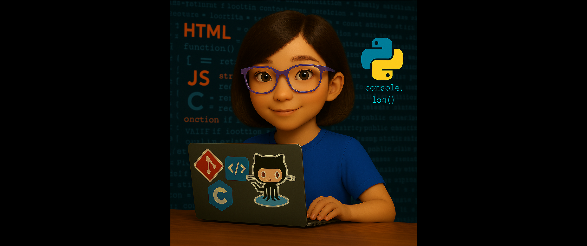

<!--
**AkoKBIkeda/AkoKBIkeda** is a ✨ _special_ ✨ repository because its `README.md` (this file) appears on your GitHub profile.

Here are some ideas to get you started:

- 🔭 I’m currently working on MSA!
- 🌱 I’m currently learning ...
- 👯 I’m looking to collaborate on ...
- 🤔 I’m looking for help with ...
- 💬 Ask me about ...
- 📫 How to reach me: ...
- 😄 Pronouns: ...
- ⚡ Fun fact: ...
-->

# Kia ora, I'm Ako 👋
Recent Bachelor of Computing Systems graduate passionate about building efficient, user-friendly software that genuinely improves people’s lives in ethical and trustworthy ways.  
  
### 👩‍💻 I recently worked on  
**Chingu Solo Project - Job Search Helper**  
Built a full-stack MVP web application to join Chingu Voyage! The app helps users keep track of their job or company research, which is what I need right now. 😊  
**Tech Stack:**  
- **Frontend:** React · Tailwind CSS · Typescript · React Hook Form · Zod · Vercel --  [Job Search Helper frontend repo](https://github.com/AkoKBIkeda/job-search-helper-frontend.git)   
- **Backend:** Django REST framework · Render -- [Job Search Helper backend repo](https://github.com/AkoKBIkeda/job-search-helper-backend)  

**Capstone Project**  
Developed a full-stack web application in collaboration with an international company, focusing on responsive UI, seamless user experience, and AI-powered features.  
**Tech Stack:**  
- **Frontend:** React · Tailwind CSS · Recharts · Jest  
- **Backend:** Django REST framework · OpenAI  

**AI Hackathon 2025 by AI Forum NZ**  
Developed an MVP suggesting balanced school lunch menus, improving variety and appeal within existing nutrition, portion, and budget constraints for centralised meal providers.    
**Tech Stack:** React · Tailwind CSS · Vercel  
  
### 🛠️ I am working on
Building a portfolio and joining the Chingu Voyage 57 as a developer!  
  
### 🧰 I’m comfortable with
〈Frontend Development〉 React · Tailwind CSS · HTML · CSS · JavaScript  
〈Backend Development & APIs〉 Django · Django REST framework · Python · OpenAI API  
〈Mobile & Desktop Development〉 Android Studio (Java) · C# Windows Forms App (.NET) · Java   
〈Tools & Platforms〉 Git · GitHub · Figma · Jira (AgileBox) · Confluence  
  
### 🌱 I’m currently learning
TypeScript, Vite, clean architecture in full-stack projects, mobile development frameworks, and cloud computing.  
  
### 🤝 I value
- Collaboration and clear communication
- Continuous learning and improvement
- Building software that positively impacts users and the community
  
🧭 *"There’s always something new to learn, and wonderful people to learn from, exchange ideas with, and grow alongside."*
